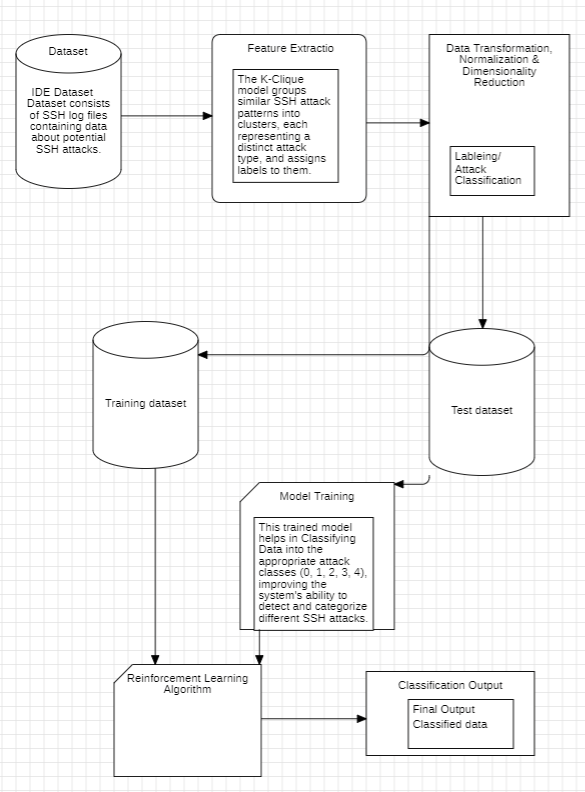

# Intelligent-SSH-Attack-Detection-model-using-K-Clique-Clustering-and-Reinforcement-Learning-
Intelligent SSH Attack Detection model using K-Clique Clustering and Reinforcement Learning 
# Intelligent SSH Attack Detection Model using K-Clique Clustering and Reinforcement Learning

This project implements an intelligent system to detect SSH brute-force attacks using **K-Clique Clustering** for graph-based clustering and **Reinforcement Learning** to adapt to evolving attack patterns. The model processes SSH logs, identifies suspicious IP clusters, and uses machine learning techniques to enhance detection capabilities.

## Table of Contents
- [Features](#features)
- [Project Structure](#project-structure)
- [Methodology](#methodology)
- [Installation](#installation)
- [Usage](#usage)
- [Example Code](#example-code)
- [Results](#results)
- [Future Enhancements](#future-enhancements)
- [Authors](#authors)
- [License](#license)

## Features

- **SSH Log Parsing**: Extracts relevant features from SSH log files, including IP addresses, timestamps, usernames, and connection statuses.
- **Graph-Based Clustering**: Uses **K-Clique Percolation** to detect clusters of IP addresses that may indicate coordinated attack attempts.
- **Reinforcement Learning**: A learning model continuously adapts and improves detection performance based on feedback from past detections.
- **Real-Time Monitoring**: Enables detection and mitigation of brute-force attacks in real-time by analyzing SSH logs.
- **Mitigation Strategy**: Suggests appropriate mitigation actions, such as blocking suspicious IPs or sending alerts to system administrators.

## Project Structure



## Methodology

1. **Log Preprocessing**: Parse SSH logs and extract important features such as IP addresses, timestamps, and connection attempts.
2. **Network Graph Construction**: Build a graph where nodes represent IP addresses and edges represent SSH interactions between IPs.
3. **K-Clique Clustering**: Use K-Clique Percolation to identify clusters of suspicious IP addresses that may indicate malicious behavior.
4. **Reinforcement Learning Integration**: The model continuously learns from new data to improve attack detection and adapts to new attack patterns.
5. **Mitigation Actions**: Based on detected patterns, the system can trigger responses like blocking IPs or alerting administrators.

## Installation

Follow these steps to install and set up the project on your local machine.

1. Clone the repository:
   ```bash
   git clone https://github.com/your-username/intelligent-ssh-attack-detection.git
   cd intelligent-ssh-attack-detection
